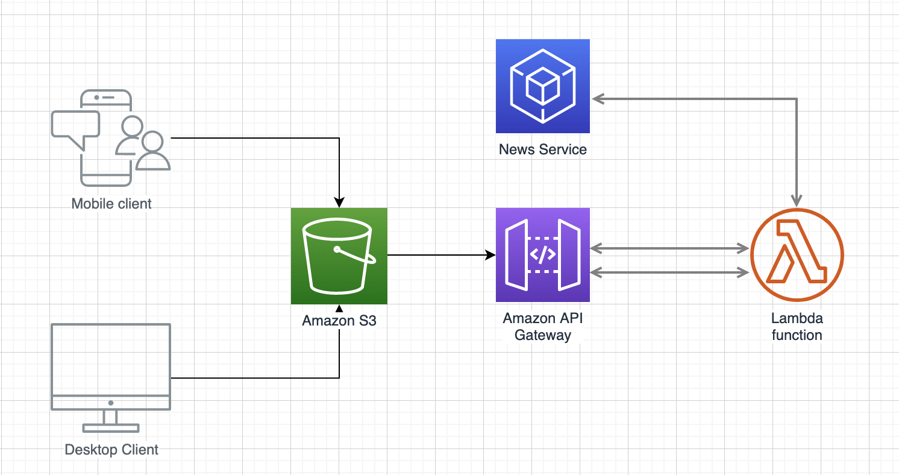
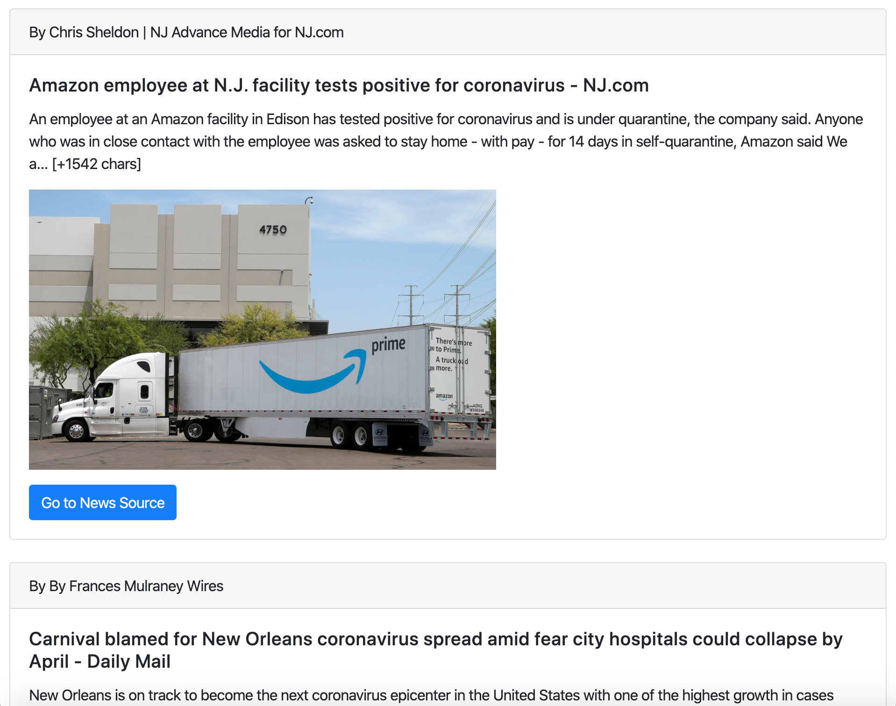

# AWS Lambda COVID-19 Headline News API

This is a sample AWS Python3 COVID-19 Headline News API. The following diagram illustrates the design, as shown below, you can create an HTML file inside an S3 bucket, and in this HTML file, you can send an XHR request to the Lambda function and then you can render the news as you wish:


## How to run this sample?

To be able to run this sample, you need to get an API key from https://newsapi.org/

## Client Sample
You can use this code as a client sample that calls Lambda service.

```
<html>
    <head>
        <script type="text/javascript" src="https://ajax.googleapis.com/ajax/libs/jquery/1.7.2/jquery.min.js"></script>
        <link rel="stylesheet" href="https://stackpath.bootstrapcdn.com/bootstrap/4.4.1/css/bootstrap.min.css" integrity="sha384-Vkoo8x4CGsO3+Hhxv8T/Q5PaXtkKtu6ug5TOeNV6gBiFeWPGFN9MuhOf23Q9Ifjh" crossorigin="anonymous">
        <script>
            $(document).ready(function() {
                $.get("[Here Place your API Endpoint URL]", function(data) {
                  var content = "";                  
                  for (var i = 0; i < data.length; ++i) {
                      content += createCard(data[i].author, data[i].title, data[i].description, data[i].imageUrl, data[i].newsUrl);
                  }
                  
                  $("#result").html(content);
                });
            });
            
            function createCard(author, title, description, imageUrl, newsUrl) {
                if (description == null) {
                    description = "To be provided soon";
                }
                
                return "<div class=\"card\">" + 
                            "<div class=\"card-header\">" +
                           "By " + author + 
                            "</div>" +
                          "<div class=\"card-body\">" +
                          "<h5 class=\"card-title\">" + title + "</h5>" +
                          "<p class=\"card-text\">" + description + "</p>" +
                          "<p></p>" +
                          "<a target=\"_blank\" href=\"" + newsUrl + "\" class=\"btn btn-primary\">Go to News Source</a>" + 
                            "</div>"+
                        "</div><br/>";
            }
        </script>
        <style>
            body {
              padding: 10px;
            }
            h1 {
              padding-bottom: 5px;
            }
            .jumbotron {
              color: white;
              background-image: url("covid19.jpg");
              background-position: center;
              background-repeat: no-repeat;
              background-size: cover;
            }            
        </style>
    </head>
    <body>
        <div class="jumbotron jumbotron-fluid">
          <div class="container">
            <h1 class="display-4">COVID-19 Breakout!</h1>
            <p>Get the latest news about this virus from different News sources</p>
          </div>
        </div>    
        <div id="result">
        </div>
    </body>
</html>
```

## Output
The client output will be rendered as shown below.


